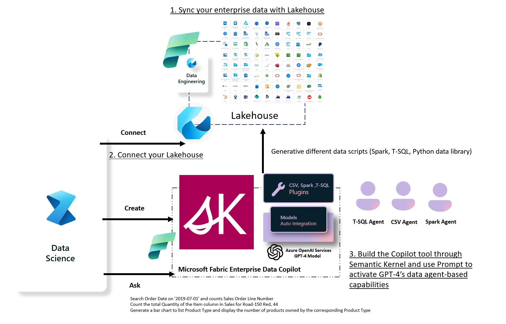

# Chat your structured data in Microsoft Fabric with Semantic Kernel

Using Microsoft Fabric’s Lakehouse we can manage different data sources. Today Copilot app is popular, we hope that Microsoft Fabric can become an indispensable part of enterprise data management and make it easier for enterprise data to connect with LLM. This sample will combine data engineering and data science perspectives to construct Copilot tools based on business data in Microsoft Fabirc.

